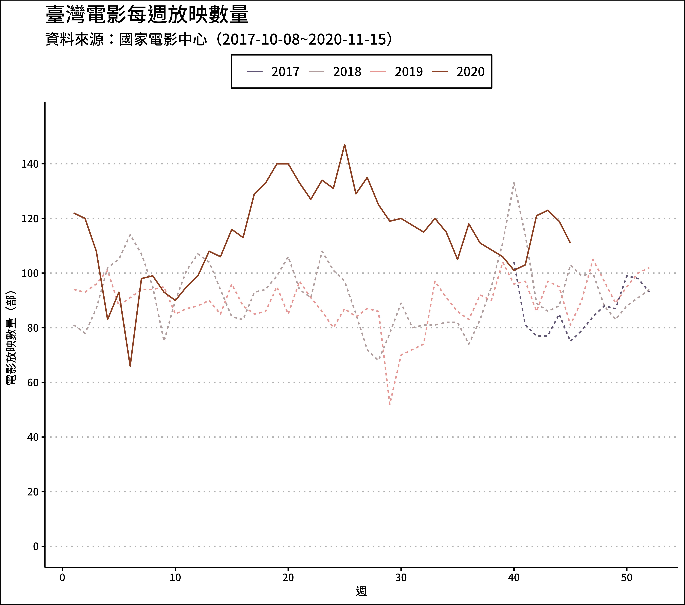
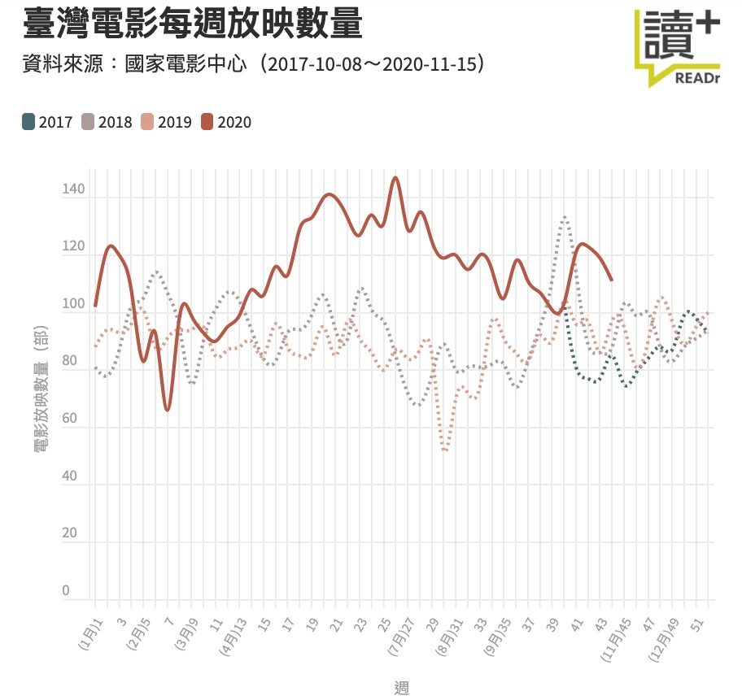
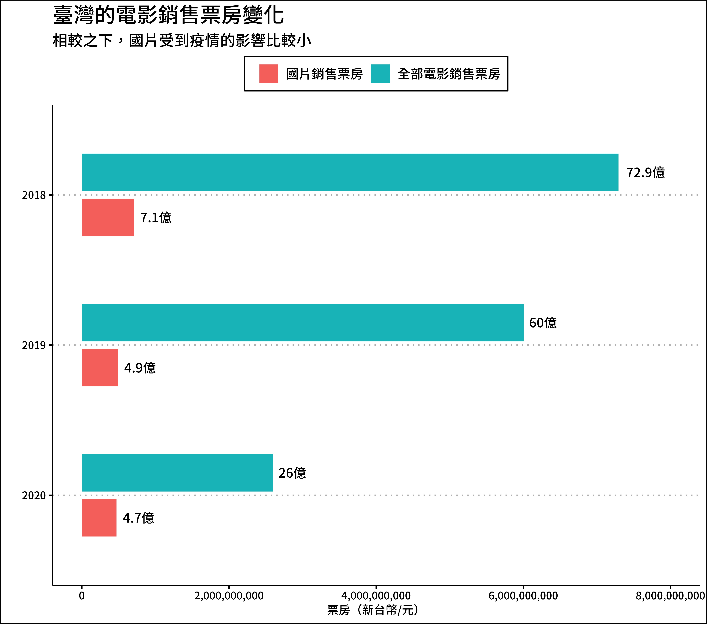
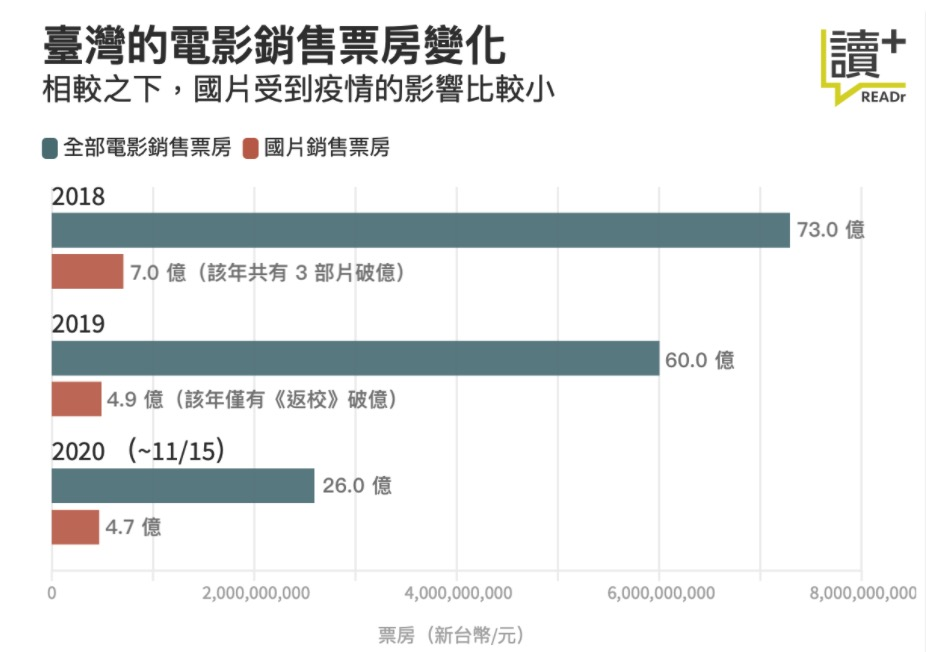
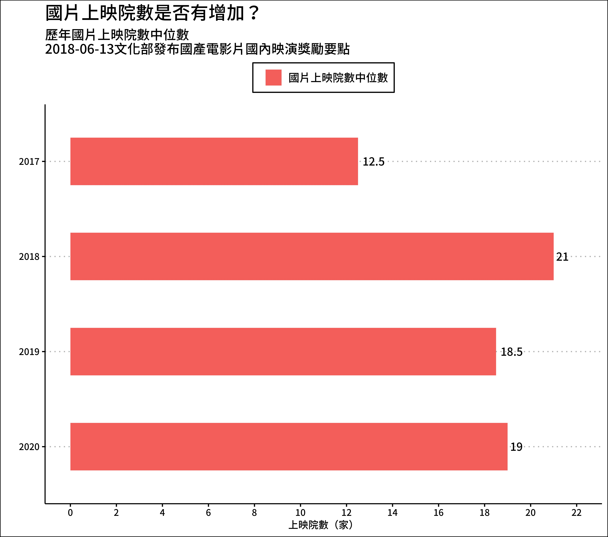
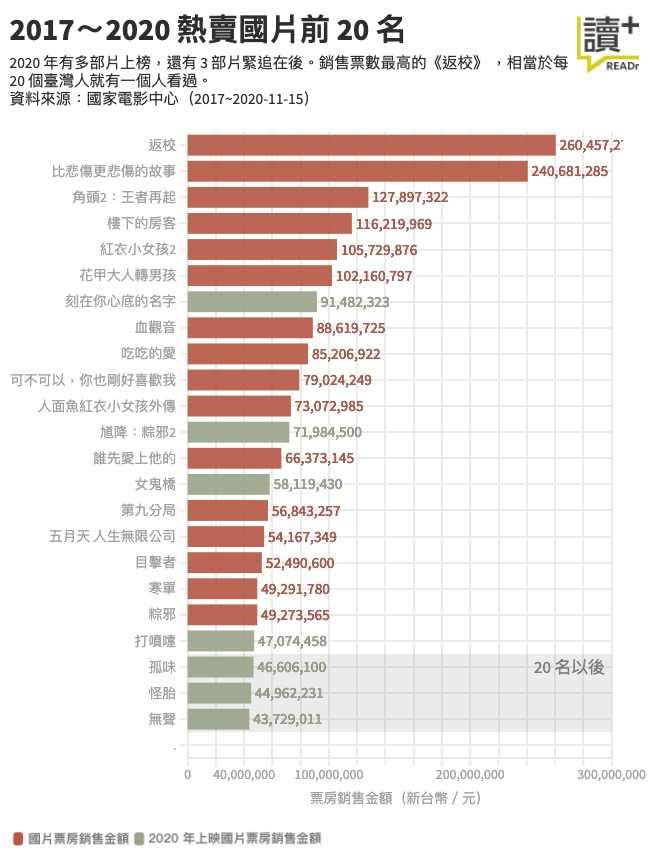

```{r setup, include=FALSE}
knitr::opts_chunk$set(echo = TRUE, results = 'hold', comment = '#>', error = TRUE)
```

## 作業目的: Data Visualization (01) Datetime

這份作業希望能夠讓你熟悉於處理日期與時間資料，並且利用視覺化的文法(grammar of graphics) 呈現結果。過程中會用到前幾週學過 dplyr 的動詞，以及 lubridate 和 ggplot2。每個小題都請寫下你的原始碼並且畫出圖表。

這次的作業使用 readr 提供的[原始資料](https://github.com/readr-media/readr-data/tree/master/movie_tickets)，主題是台灣的電影票房，有興趣的話可以點進 [【數讀國片票房】全球影視寒冬，2020 臺灣電影如何逆勢崛起](https://www.readr.tw/post/2522) 看一下這篇資料新聞。每一個小題都是新聞上的一張圖表！

## 作業: Data Visualization (01) Datetime

```{r message=FALSE, warning=FALSE}
### 這邊不要動
library(tidyverse)
library(lubridate)
library(ggthemes)

df_movie_raw <- read_csv("data/AS04/movie_tickerts_2017_2020.csv")
### 給你看資料長這樣
df_movie_raw %>% glimpse()
```

### 1. `geom_line()`:

請參考 readr 的圖表，畫出台灣 2017/10 ~ 2020/11 每週的放映數量，並且用不同顏色的曲線表示年份，其中 2020 年的曲線以實線表示，2017 - 2019 年的曲線則以虛線(dotted line)表示。

可以參考 data -> AS04 -> plot_01.jpg，或者直接看 readr 報導當中標題為「臺灣電影每週放映數量」的圖表。因為週次計算方式可能有差異，因此不要求和 readr 計算出的數字完全相同，呈現類似趨勢即可。週次的計算方式可以挑選 **`start_date`** 作為基準。

keywords：
`geom_line()`, `week()`, `color = ?`, `linetype = ?`

```{r message=FALSE, warning=FALSE}
### your code

### your result should be (參考)

```


```{r, echo=FALSE}

```

### 2. `geom_bar()` or `geom_col()`:

請參考 readr 的圖表，畫出台灣 2017 - 2020 每年所有電影票房與國片票房的長條圖，並以併排(dodge)方式呈現。

可以參考 data -> AS04 -> plot_02.jpg，或者直接看 readr 報導當中標題為「臺灣的電影銷售票房變化」的圖表。本題要求和 readr 的數字相同。年份的計算方式可以挑選 **`start_date`** 作為基準。

keywords：
`geom_bar/col()`, `year()`, `fill = ?`

```{r message=FALSE, warning=FALSE}
### your code

### your result should be (參考)


```


```{r, echo=FALSE}

```

### 3. `geom_bar()` or `geom_col()`:

請參考 readr 的圖表，畫出台灣 2017 - 2020 每年國片上映院數的中位數長條圖。

可以參考 data -> AS04 -> plot_03.jpg，或者直接看 readr 報導當中標題為「國片上映院數是否有增加？」的圖表。本題要求和 readr 的數字相同。上映日期的計算方式可以直接使用 **`上映日期`** 欄位。

keywords：
`geom_bar/col()`, `year()`, `fill = ?`

```{r message=FALSE, warning=FALSE}
### your code

### your result should be (參考)


```


```{r, echo=FALSE}
knitr::include_graphics('data/AS04/plot_03.jpg')
```

### 4. `geom_bar()` or `geom_col()`:

請參考 readr 的圖表，畫出台灣 2017 - 2020 國片累計銷售金額的長條圖，篩選出銷售金額前 23 高的國片後由大到小排列。（圖表中有部片叫做《可不可以，你也剛好喜歡我》，它是 2020 年上映的，readr 應該漏標了。）

可以參考 data -> AS04 -> plot_04.jpg，或者直接看 readr 報導當中標題為「2017 ~ 2020 熱賣國片前 20 名」的圖表。本題要求和 readr 的數字相同。上映日期的計算方式可以直接使用 **`上映日期`** 欄位。

keywords：
`geom_bar/col()`, `year()`, `fill = ?`

```{r message=F, warning=F}
### your code

### your result should be (參考)
knitr::include_graphics('data/AS04/plot_04_ggplot.jpg')

```

```{r, echo=FALSE}

```
