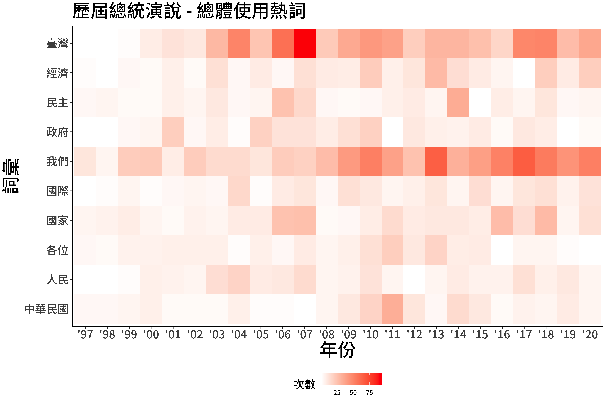

```{r setup, include=FALSE}
knitr::opts_chunk$set(echo = TRUE, results = 'hold', comment = '#>', error = TRUE)
```

## 作業目的:   

這份作業希望能夠讓你熟悉中文文字處理，並執行基本的文字相關分析，再將結果以圖表呈現。過程中會運用到過去幾週影片中的 document-level, word-level text analysis, regular expression, and text mining.

這次的作業使用維基文庫提供的「[歷任中華民國總統國慶演說](https://zh.m.wikisource.org/wiki/%E7%B8%BD%E7%B5%B1%E8%92%9E%E8%87%A8%E4%B8%AD%E8%8F%AF%E6%B0%91%E5%9C%8B%E4%B9%9D%E5%8D%81%E4%B8%80%E5%B9%B4%E5%9C%8B%E6%85%B6%E5%A4%A7%E6%9C%83%E8%87%B4%E8%A9%9E)」。之前這堂課曾經以總統就職演說為題目，今年則替換為國慶演說。國內外媒體時常使用演說的內文當作素材，利用文字探勘的技巧寫出報導，以 2020 年的的總統就職演說為例，大家可以參考中央社的[蔡總統關心什麼 文字會說話
](https://www.cna.com.tw/project/20200520-inauguraladdress/) 以及 readr 的 [少了「年輕人」多了「防疫」：臺灣歷屆民選總統就職演說字詞分析
](https://www.readr.tw/post/2433)。國外的則可以參考 [“I Have The Best Words.” Here's How Trump’s First SOTU Compares To All The Others.](https://www.buzzfeednews.com/article/peteraldhous/trump-state-of-the-union-words#.tbr8QJvA7) by BuzzFeed, [Word Aanalysis of 2016 Presidential debates - Clinton vs. Trump](http://mkweb.bcgsc.ca/debates2016/) by Martin Krzywinski, and [Trump used words like 'invasion' and 'killer' to discuss immigrants at rallies 500 times: USA TODAY analysis](https://www.usatoday.com/story/news/politics/elections/2019/08/08/trump-immigrants-rhetoric-criticized-el-paso-dayton-shootings/1936742001/) by USA today.

```{r message=FALSE, warning=FALSE}
### 這邊不要動
library(tidyverse)
library(jiebaR)
library(tidytext)
library(lubridate)

df_speech_clean <- read_csv("data/AS07/df_speech_clean.csv")
### 給你看資料長這樣
df_speech_clean %>% glimpse()
```

### 0. 斷詞:

請利用 `library(jiebaR)` 斷詞，過程中也要保留詞性的欄位。

```{r message=FALSE, warning=FALSE}
### your code

```

### 1. 整體熱門詞彙:

請先找出所有總統演說當中出現次數最高的 10 個詞彙，接著計算每屆總統演說時，這些詞彙出現的次數，最後將結果畫成圖表。因為斷詞結果會因為預先載入的詞典有所不同，所以底下的示意圖參考即可，請盡量呈現 **有意義的** 詞彙！

```{r message=FALSE, warning=FALSE}
### your code


### your result should be
# 自己畫就好唷

```

```{r, echo=FALSE}

```

### 2. 各自熱門詞彙:

請先找出各個總統演說中，出現次數最高的 10 個詞彙，並且將結果畫成圖表。因為斷詞結果會因為預先載入的詞典有所不同，所以底下的示意圖參考即可，請盡量呈現 **有意義的** 詞彙！

```{r message=FALSE, warning=FALSE}
### your code

### your result should be
# 自己畫就好唷

```


```{r, echo=FALSE}
knitr::include_graphics('data/AS07/plot02.png')
```

### 3. TF-IDF:

請先篩掉各個總統演說中出現次數小於 5 的詞彙，接著計算 TF-IDF (不知道這是什麼的話請看老師影片！)，最後將結果畫成圖表。因為斷詞結果會因為預先載入的詞典有所不同，所以底下的示意圖參考即可，請盡量呈現 **有意義的** 詞彙！

```{r message=FALSE, warning=FALSE}
### your code

### your result should be
# 自己畫就好唷

```


```{r, echo=FALSE}
knitr::include_graphics('data/AS07/plot03.png')
```

### 4. 捉對廝殺:

請先留下蔡英文和馬英九的用詞，接著計算兩者用詞數量差異最大各自前十名的詞彙，最後將結果畫成圖表。因為斷詞結果會因為預先載入的詞典有所不同，所以底下的示意圖參考即可，請盡量呈現 **有意義的** 詞彙！

```{r message=F, warning=F}
### your code

### your result should be
# 自己畫就好唷

```

```{r, echo=FALSE}
knitr::include_graphics('data/AS07/plot04.png')
```

### 結語

https://collabin.netlify.app/don/tongxinglian-in-samesex-marriage-corpora-2/

一個文字探勘的實例，覺得結尾說得很好

"最近剛好在一堂課的讀本中讀到一句話：
Computer-assisted text analysis [is] an activity best employed not in the service of a heightened critical objectivity, but as one that embraces the possibilities of that deepened subjectivity upon which critical insight depends.

這是 Stephen Ramsay 在其文章 “Toward an algorithmic criticism” (2003. Literary and Linguistic Computing, 18(2): 167-174)中所討論的，究竟電腦與演算法在言談分析和文本分析中扮演著什麼樣的角色。他認為演算法的嚴密與正確並不是分析的終點，客觀性與實證主義式的真理也不是所追求的目標，更重要的在於演算法是否讓分析者看見了原本看不見的，從而能針對文本做出更深刻的討論。（後來發現他有寫成一本書：Reading Machines: Toward an Algorithmic Criticism）

在練習用不同的工具分析文本的過程中，好像真的看到了工具所看到的某種世界。"

「讓分析者看見了原本看不見的，從而能針對文本做出更深刻的討論」讚喔！