<style type="text/css">

.remark-slide-content {
    padding: 1em 1em 1em 1em;
    font-size: 28px;
}

.my-one-page-font {
  padding: 1em 1em 1em 1em;
  font-size: 20px;
  /*xaringan::inf_mr()*/
}

</style>

```{r message=FALSE,warning=FALSE,echo=FALSE}

```

# 自我介紹

<ul>
<li>personal background
    <ul>
    <li>學校：工管系企管組畢業，新聞所碩二</li>
    <li>實習：電商數據分析、城市數據分析、新聞數位敘事</li>
    </ul>
<li>Interest
    <ul>
    <li>領域：資料分析、資料新聞</li>
    <li>方法：統計、空間分析、社群網絡分析</li>
    </ul>
<li>Teaching experience
    <ul>
    <li>109-2 新聞資料處理與視覺呈現</li>
    <li>109-寒假 text mining</li>
    <li>108-1 資料科學與社會研究, 資料新聞工作坊</li>
    <li>家教: R & 統計, R & text mining</li>
    </ul>
</ul>

---

# What can R do?

- R 可以做很多事
- 產生網頁、架設部落格、寫書
- 輸出成 word, PTT, html 多種格式
- 對學生/記者來說呢

```{r, echo=FALSE}
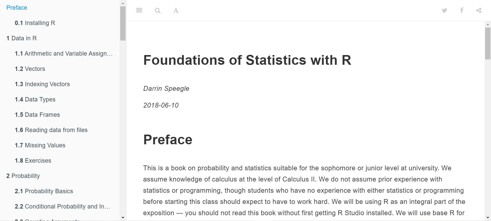
```

---

# What can R do?

- 之前的作業：處理資料

```{r, echo=FALSE}
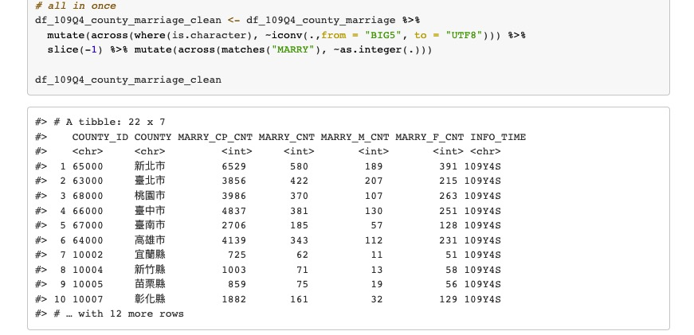
```

---

# What can R do?

- 之前的作業：視覺化公投結果

```{r, echo=FALSE}
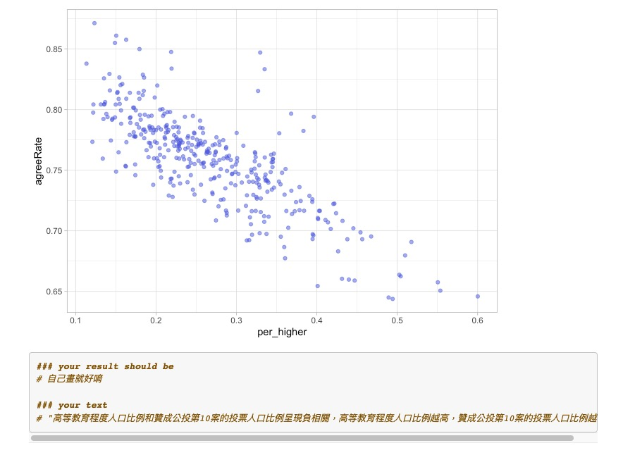
```

---

# What can R do?

- 之前的作業：分析總統演說內容

```{r, echo=FALSE}
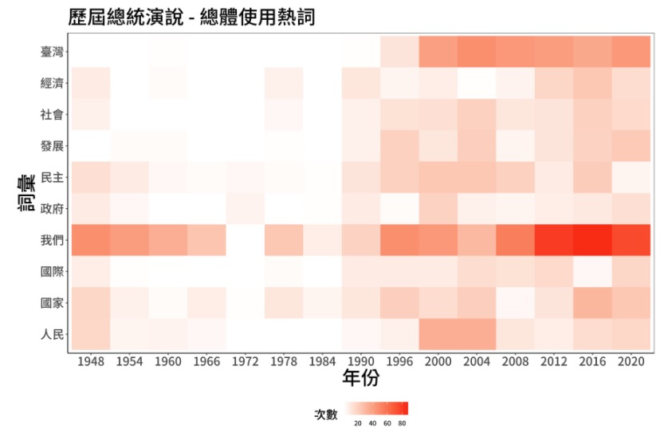
```

---

# What can R do?

- 之前的作業：爬網站資料

```{r, echo=FALSE}
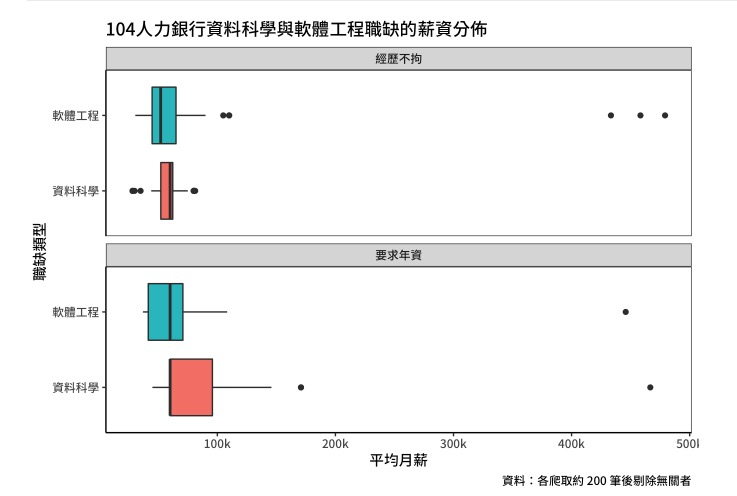
```

---

# What can R do?

- 之前的作業：畫地圖

```{r, echo=FALSE}
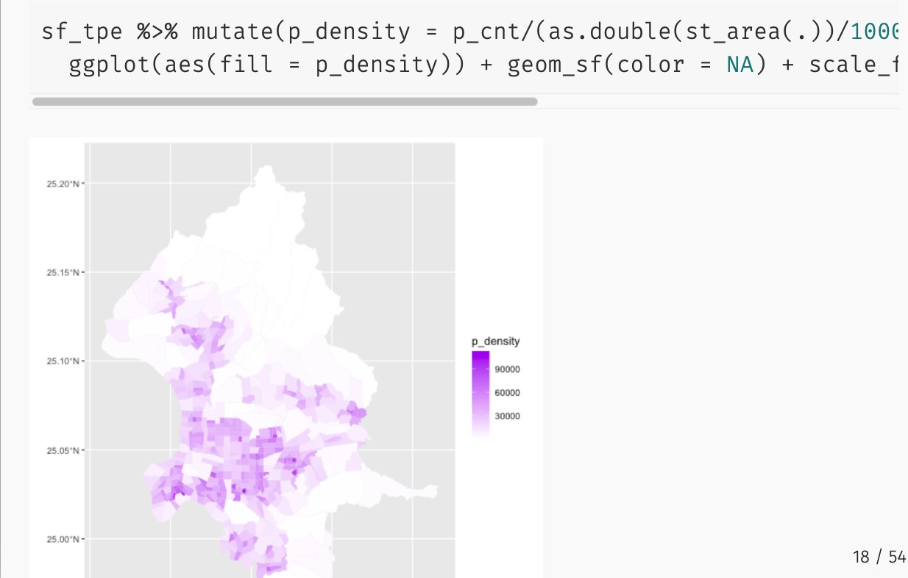
```

---

# Who uses R?

- 媒體業常常使用 R，不唬爛
- The Economist

```{r out.width='90%', out.height='90%',echo=FALSE}
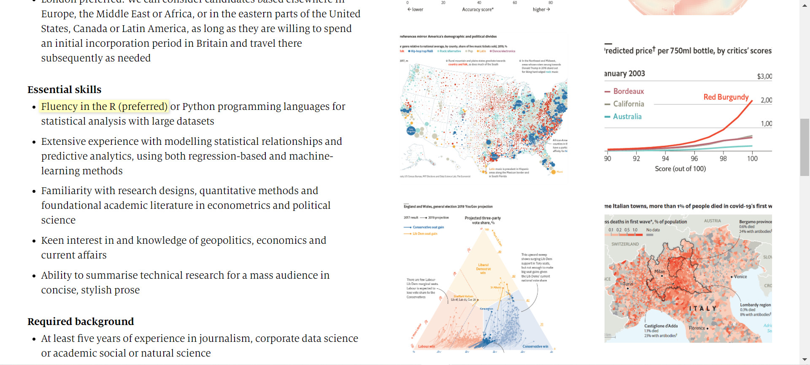
```

---

# Who uses R?

- 媒體業常常使用 R，不唬爛
- BBC

```{r out.width='90%', out.height='90%',echo=FALSE}
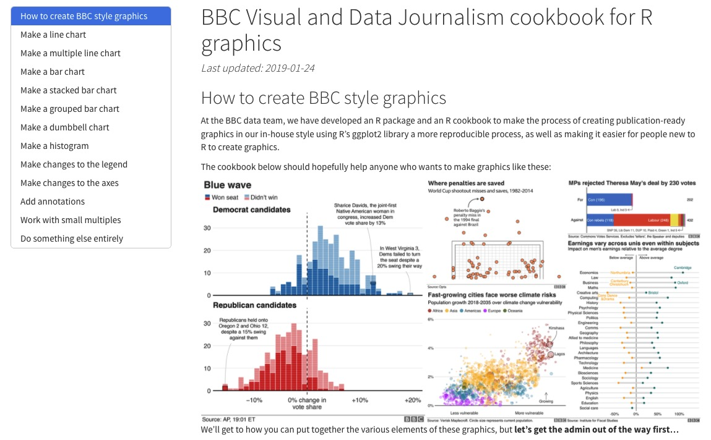
```

---

# Who uses R?

- 媒體業常常使用 R，不唬爛
- Financial Times

```{r out.width='90%', out.height='90%',echo=FALSE}
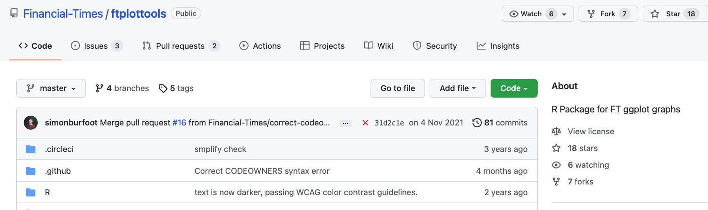
```

---

# Who uses R?

- 台灣的案例
- readr

```{r out.width='90%', out.height='90%',echo=FALSE}
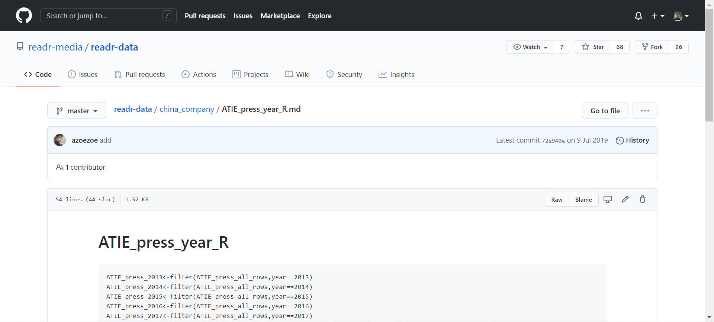
```
---

# Who uses R?

- 台灣的案例
- 天下雜誌

```{r out.width='90%', out.height='90%',echo=FALSE}
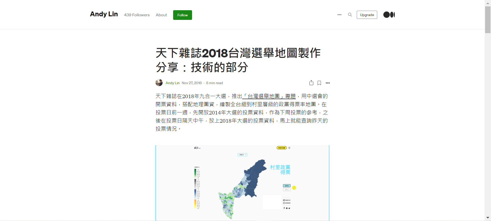
```

---

# You can ... after taking this course

- 獲取資料：從不同來源獲取數據，包含 open data, API, 寫爬蟲 
- 讀取資料：讀進各類型的資料，包含 csv, JSON, shapefile 等
- 清理資料：格式轉換, 寫條件判斷, 中英文處理, missing value
- 資料變換：探索, 摘要, 欄位增減, 分組, 長寬表格轉換
- 資料視覺化：在 R 中繪製有意義且好看、好讀的圖表
- 文字探勘：學習 tf-idf, LDA, word segmentation 等概念並使用
- 空間資料處理：應對空間資料結構, 把 R 當成 GIS, 繪製地圖

---

# 我負責的事情

- Lab
 - Tutorial: 複習老師授課, 補充額外知識, 用簡報上課
 - Practice: 出一些練習題讓同學熟悉當週內容
- Assigment
 - 以老師上課與回家內容為出題方向
 - 盡量使用 real, local, daily 的資料貼近實務
 - 不會每週都有

---
# 一些不錯的資源 

- Meetup
 - [R-Ladies Taipei](https://www.facebook.com/groups/RLadiesTaipei/permalink/2305950439482020)
 - [Taiwan R User Group](https://www.meetup.com/Taiwan-R/)
- Facebook Group
 - [台灣R軟體Club](https://www.facebook.com/groups/1210634969026548)
 - [大數俱樂部](https://www.facebook.com/groups/242102892820317)
- Asking Questions
 - [stackoverflow](https://stackoverflow.com/)
 - [PTT R_Language](https://www.ptt.cc/bbs/R_Language/index.html)
- Other
 - [Bookdown](https://bookdown.org/)
 - [Rweekly](https://rweekly.org/)

---

class: inverse, center, middle

# Enjoy Learing 

希望 R 能變成你的第二外語！


