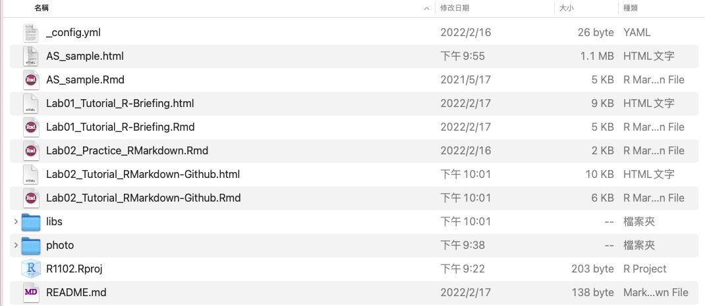

<style type="text/css">

.remark-slide-content {
    padding: 1em 1em 1em 1em;
    font-size: 28px;
}

.my-one-page-font {
  padding: 1em 1em 1em 1em;
  font-size: 20px;
  /*xaringan::inf_mr()*/
}

</style>

```{r message=FALSE,warning=FALSE,echo=FALSE}

```

# Github

- Github
 - 先去[官網](https://github.com/)註冊帳號
 - 使用原因一：[團隊協作](https://github.com/cwgrouptw/data)
 - 使用原因二：[版本控制](https://github.com/p4css/R4CSS_TA_1102/commit/2e956ac7fbab8885d240d714a9d05b79a13cf332)

```{r out.width='60%', out.height='60%', echo=FALSE}
knitr::include_graphics('photo/Lab02_ppt.png')
```

---

# Github & Github Desktop

- Material
 - 老師上課的 code [連結](https://github.com/P4CSS/R4CSS)
 - 老師上課的 data [連結](https://github.com/P4CSS/R4CSSData)
 - 助教 lab 和作業的  [連結](https://github.com/P4CSS/R4CSS_TA_1102)
- Github Desktop
 - 去[官網](https://desktop.github.com/)下載，然後登入
 - 再去剛剛作業的[連結](https://github.com/P4CSS/R4CSS_TA_1102)
 - 找到右上角的 `Code` 按下，然後可以選擇 download ZIP 或者 open with github desktop，兩者各有優缺

---
# 檔案更新與交作業

- Download ZIP
 - 打開 Github 網頁，只要雲端上有更新，就全部下載
 - 優點：簡單(不用理解 push, pull, commit)
 - 缺點：檔案大時較為耗時
- Open with Gihtub Desktop
 - 打開 Github Desktop，只要雲端上有更新，就點擊 `pull` 
 - 優點：快速(因為只要抓有更新的檔案)
 - 缺點：要知道一些知識
- 交作業
 - 下載作業後編輯 Rmarkdown，完成後輸出成 html
 - 繳交 Rmarkdown 與 html 至 NTU Cool
 
---
# 檔案格式

- R
 - 檔案名稱以.R 作為結尾，平常都在裡面寫程式
- Rmd
 - 檔案名稱以.Rmd 作為結尾，裡面可以寫文字也可以寫程式
 - Lab 的 homework 跟 Assignment 都用這個編寫
- html
 - 檔案名稱以.html 作為結尾，用來組織架構並呈現網頁內容
 - Lab 的 homework 跟 Assignment 都輸出成這個

---
# RMarkdown 與 Markdown

- Markdown
 - 一種標記語言，特色是無須透過滑鼠便可完成排版
 - 非常容易閱讀，且簡單好學不吃力
 - 中文版教學如 [Markdown Cheatsheet 中文版](https://gist.github.com/billy3321/1001749662c370887c63bb30f26c9e6e) 或者 [Gitbook語法](https://cowmanchiang.me/gitbook/gitbook/contents/how.html)
 - 英文版教學如 [Mastering Markdown](https://guides.github.com/features/mastering-markdown/)，以及 RStudio 寫的 [Pandoc Markdown
](https://rmarkdown.rstudio.com/authoring_pandoc_markdown.html)
- RMarkdown
 - 是一種檔案類型(file format)，使用者可以在 R 當中交替使用 Markdown 內文以及 R 的程式碼，並輸出多樣格式，如 hmtl, word, PDF, PPT 等，用途很廣
 - 之後的作業就是讓在 RMarkdown 中同時寫文字與程式碼

---

class: inverse, center, middle

# Practice Markdown!

Using [Markdown online editor](https://jbt.github.io/markdown-editor/)

---
# Path (路徑) and Directory (目錄)

- Path, 資料夾的地址
 - 我剛剛在`"台大新聞所四樓的 415 研究室裡面的沙發上睡覺"`
 - **absolute path 絕對路徑**，以上面的例子來說，因為你們不在 415 教室，所以我會用完整的地址`"台大新聞所四樓的 415 研究室裡面的沙發上"`描述我的位置，這是"絕對"的地址
 - **relative path 相對路徑**，以上面的例子來說，如果有同學剛剛也在 415 教室裡面，我就會跟他說我在`"沙發上"`，因為同學已經在那個空間了，這是"相對"的地址
- 實際案例
 - `"/Users/dennistseng/Documents/R4CSS-TA/data/Lab03/ARG.csv"`
 - `"data/Lab03/ARG.csv"`

---
# Path (路徑) and Directory (目錄)

- Directory, 現在在哪個資料夾
 - 舉例來說，我剛剛在的地方是 415 教室
 - working directory 代表你的 R 運行時讀檔案的起始位置
- 尋找自己的 directory
 - `getwd()`
 - `setwd()`
 - 缺點是 not self-contained, not portable
 - 別人不方便協作、資料夾變動不好恢復、同時有多專案進行時會混亂

---
# R Project (R 專案)

- R project, R 專案
 - 使用 R 專案有很多好處，其中之一在於讓你的**環境**保持乾淨
 - 環境指的是 environment，A 專案的變數不會跟 B 專案的變數打架，譬如兩邊都有 `df_country` 但內容不同
 - 打開 R4CSS_TA 裡面的 R4CSS_TA.Rproj 
 - 我寫 `read_csv("data/Lab03/ARG.csv")` 上傳 Github，下載後不用改路徑，但若寫 `"Users/子軒/碩一/學校事務/不想寫程式/R語言/R4CSS_TA/data/Lab03/ARG.csv"` 別人就沒辦法用
 - working directory 就會是R project 檔案所在的資料夾 
 
---
# R Project (R 專案)

```{r, out.width='45%', out.height='45%', echo=FALSE}
knitr::include_graphics('photo/Lab03_rproj01.jpg')
knitr::include_graphics('photo/Lab03_rproj02.jpg')
```
---
# R Project (R 專案)

- GOOD
```{r, out.width='100%', out.height='100%', echo=FALSE}
knitr::include_graphics('photo/Lab03_rproj03.jpg')
```

- BAD
```{r, out.width='100%', out.height='100%', echo=FALSE}
knitr::include_graphics('photo/Lab03_rproj04.jpg')
```

---
# R Project (R 專案)

- 剛剛都不知道在幹嘛？
 - 沒關係，剛碰的時候很難懂
 - 只要記得，打開 `.Rproj` 就對了！

```{r, out.width='100%', out.height='100%', echo=FALSE}

```

