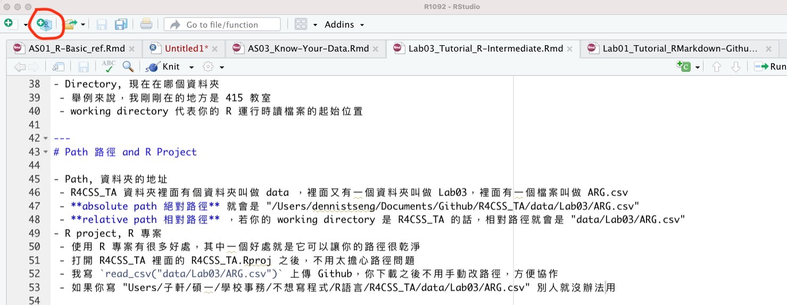
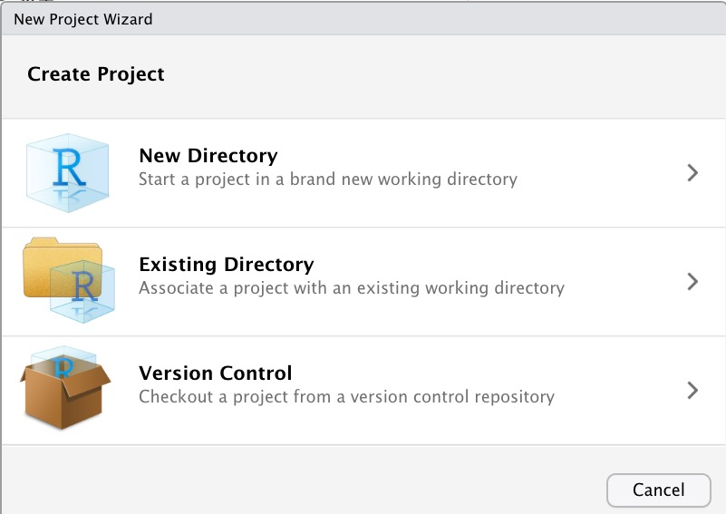
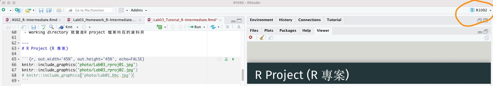
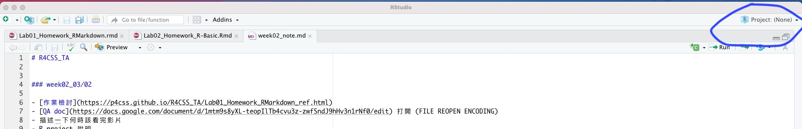

<style type="text/css">

.remark-slide-content {
    padding: 1em 1em 1em 1em;
    font-size: 28px;
}

.my-one-page-font {
  padding: 1em 1em 1em 1em;
  font-size: 20px;
  /*xaringan::inf_mr()*/
}

</style>


---

class: inverse, center, middle

# [AS01](https://p4css.github.io/R4CSS_TA_1102/AS01_Homework_R-Basic-Intermediate.html)

---

# 路徑和中文編碼

- Path 路徑
 - 資料夾的地址
 - 我剛剛在`"台大新聞所四樓的 415 研究室裡面的沙發上睡覺"`
 - **absolute path 絕對路徑**，以上面的例子來說，因為你們不在 415 教室，所以我會用完整的地址`"台大新聞所四樓的 415 研究室裡面的沙發上"`描述我的位置，這是"絕對"的地址
 - **relative path 相對路徑**，以上面的例子來說，如果有同學剛剛也在 415 研究室裡面，我就會跟他說我在`"沙發上"`，因為同學已經在那個空間了，這是"相對"的地址
- 實際例子
 - 絕對路徑 `"/Users/dennistseng/R4CSS-TA/data/Lab03/ARG.csv"`
 - 相對路徑 `"data/Lab03/ARG.csv"`

---

# 路徑和中文編碼

- 為什麼在乎
 - 檔案可能失蹤
 - 方便多人協作
- 如何取得路徑：除了堅持老派的手寫溫度
 - RStudio 右邊可以找到
 - Mac：`右鍵 再按 options` or `option + command + c`
 - Windows：`shift 再按 右鍵` or `ctrl + L`
 - Windows：直接從 `address bar` or `file explorer` 複製
 - reference：[Mac](https://kknews.cc/zh-tw/news/4ze44yq.html) & [Windows](https://www.tenforums.com/tutorials/131557-copy-path-file-explorer-windows-10-a.html)
 - 路徑中的斜線與反斜線： Mac copy 得到的路徑用 `/` 間隔，可以直接使用，Windows copy 得到的路徑用 `\` 間隔，不能直接用，要修正成 `/` or `\\`
 - `"data/a.csv"` or `"data\\a.csv"` 都可以

---
# Path (路徑) and Directory (目錄)

- Directory, 現在在哪個資料夾
 - 舉例來說，我剛剛在的地方是 415 教室
 - working directory 代表你的 R 運行時讀檔案的起始位置
- 尋找自己的 directory
 - `getwd()`
 - `setwd()`
 - 缺點是 not self-contained, not portable
 - 別人不方便協作、資料夾變動不好恢復、同時有多專案進行時會混亂

---
# R Project (R 專案)

- R project, R 專案
 - 使用 R 專案有很多好處，其中之一在於讓你的**環境**保持乾淨
 - 環境指的是 environment，A 專案的變數不會跟 B 專案的變數打架，譬如兩邊都有 `df_country` 但內容不同
 - 打開 R4CSS_TA 裡面的 R4CSS_TA.Rproj 
 - 我寫 `read_csv("data/Lab03/ARG.csv")` 上傳 Github，下載後不用改路徑，但若寫 `"Users/子軒/碩一/學校事務/不想寫程式/R語言/R4CSS_TA/data/Lab03/ARG.csv"` 別人就沒辦法用
 - working directory 就會是R project 檔案所在的資料夾 
 
---
# R Project (R 專案)

```{r, out.width='45%', out.height='45%', echo=FALSE}


```
---
# R Project (R 專案)

- GOOD
```{r, out.width='100%', out.height='100%', echo=FALSE}

```

- BAD
```{r, out.width='100%', out.height='100%', echo=FALSE}

```

---

class: inverse, center, middle

# [AS02](https://p4css.github.io/R4CSS_TA_1102/AS02_Homework_know-your-data.html)